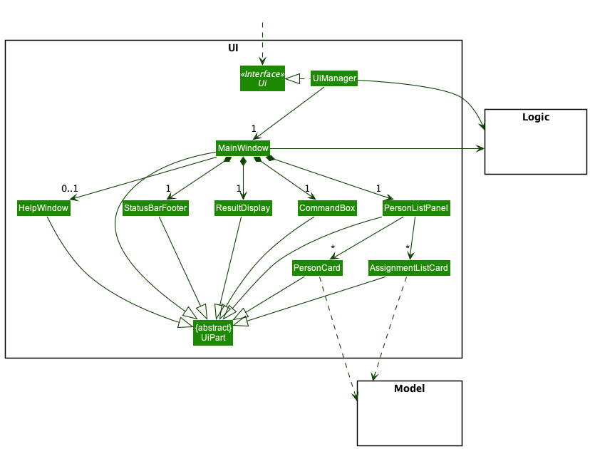
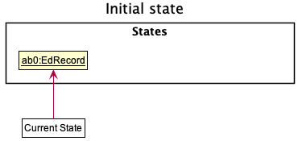
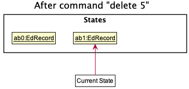
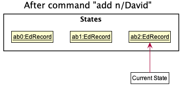
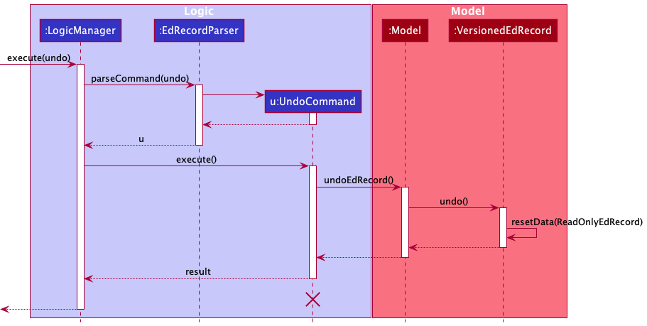
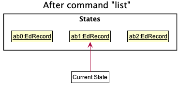

- Table of Contents
  {:toc}

---

## **Acknowledgements**

This project is based on the [AddressBook-Level3](https://github.com/se-edu/addressbook-level3/) project created by the [SE-EDU initiative](https://se-education.org).

---

## **Setting up, getting started**

Refer to the guide [_Setting up and getting started_](SettingUp.md).

---

## **Design**

:bulb: **Tip:** The `.puml` files used to create diagrams in this document can be found in the [diagrams](https://github.com/AY2122S1-CS2103-W14-3/tp/tree/master/docs/diagrams/) folder. Refer to the [_PlantUML Tutorial_ at se-edu/guides](https://se-education.org/guides/tutorials/plantUml.html) to learn how to create and edit diagrams.

### Architecture

The **_Architecture Diagram_** given above explains the high-level design of the App.

Given below is a quick overview of main components and how they interact with each other.

**Main components of the architecture**

**`Main`** has two classes called [`Main`](https://github.com/AY2122S1-CS2103-W14-3/tp/tree/master/src/main/java/seedu/edrecord/Main.java) and [`MainApp`](https://github.com/AY2122S1-CS2103-W14-3/tp/tree/master/src/main/java/seedu/edrecord/MainApp.java). It is responsible for,

- At app launch: Initializes the components in the correct sequence, and connects them up with each other.
- At shut down: Shuts down the components and invokes cleanup methods where necessary.

[**`Commons`**](#common-classes) represents a collection of classes used by multiple other components.

The rest of the App consists of four components.

- [**`UI`**](#ui-component): The UI of the App.
- [**`Logic`**](#logic-component): The command executor.
- [**`Model`**](#model-component): Holds the data of the App in memory.
- [**`Storage`**](#storage-component): Reads data from, and writes data to, the hard disk.

**How the architecture components interact with each other**

The _Sequence Diagram_ below shows how the components interact with each other for the scenario where the user issues the command `delete 1`.

Each of the four main components (also shown in the diagram above),

- defines its _API_ in an `interface` with the same name as the Component.
- implements its functionality using a concrete `{Component Name}Manager` class (which follows the corresponding API `interface` mentioned in the previous point.

For example, the `Logic` component defines its API in the `Logic.java` interface and implements its functionality using the `LogicManager.java` class which follows the `Logic` interface. Other components interact with a given component through its interface rather than the concrete class (reason: to prevent outside component's being coupled to the implementation of a component), as illustrated in the (partial) class diagram below.

The sections below give more details of each component.

### UI component

The **API** of this component is specified in [`Ui.java`](https://github.com/AY2122S1-CS2103-W14-3/tp/tree/master/src/main/java/seedu/edrecord/ui/Ui.java)

The UI consists of a `MainWindow` that is made up of parts e.g.`CommandBox`, `ResultDisplay`, `PersonListPanel`, `StatusBarFooter` etc. All these, including the `MainWindow`, inherit from the abstract `UiPart` class which captures the commonalities between classes that represent parts of the visible GUI.

The `UI` component uses the JavaFx UI framework. The layout of these UI parts are defined in matching `.fxml` files that are in the `src/main/resources/view` folder. For example, the layout of the [`MainWindow`](https://github.com/AY2122S1-CS2103-W14-3/tp/tree/master/src/main/java/seedu/edrecord/ui/MainWindow.java) is specified in [`MainWindow.fxml`](https://github.com/AY2122S1-CS2103-W14-3/tp/tree/master/src/main/resources/view/MainWindow.fxml)

The `UI` component,

- executes user commands using the `Logic` component.
- listens for changes to `Model` data so that the UI can be updated with the modified data.
- keeps a reference to the `Logic` component, because the `UI` relies on the `Logic` to execute commands.
- depends on some classes in the `Model` component, as it displays `Person` object residing in the `Model`.

### Logic component

**API** : [`Logic.java`](https://github.com/AY2122S1-CS2103-W14-3/tp/tree/master/src/main/java/seedu/edrecord/logic/Logic.java)

Here's a (partial) class diagram of the `Logic` component:

How the `Logic` component works:

1. When `Logic` is called upon to execute a command, it uses the `EdRecordParser` class to parse the user command.
1. This results in a `Command` object (more precisely, an object of one of its subclasses e.g., `AddCommand`) which is executed by the `LogicManager`.
1. The command can communicate with the `Model` when it is executed (e.g. to add a person).
1. The result of the command execution is encapsulated as a `CommandResult` object which is returned back from `Logic`.

The Sequence Diagram below illustrates the interactions within the `Logic` component for the `execute("delete 1")` API call.

:information_source: **Note:** The lifeline for `DeleteCommandParser` should end at the destroy marker (X) but due to a limitation of PlantUML, the lifeline reaches the end of diagram.

Here are the other classes in `Logic` (omitted from the class diagram above) that are used for parsing a user command:

How the parsing works:

- When called upon to parse a user command, the `EdRecordParser` class creates an `XYZCommandParser` (`XYZ` is a placeholder for the specific command name e.g., `AddCommandParser`) which uses the other classes shown above to parse the user command and create a `XYZCommand` object (e.g., `AddCommand`) which the `EdRecordParser` returns back as a `Command` object.
- All `XYZCommandParser` classes (e.g., `AddCommandParser`, `DeleteCommandParser`, ...) inherit from the `Parser` interface so that they can be treated similarly where possible e.g, during testing.

### Model component

**API** : [`Model.java`](https://github.com/AY2122S1-CS2103-W14-3/tp/tree/master/src/main/java/seedu/edrecord/model/Model.java)

The `Model` component,

- stores EdRecord data i.e., all `Person` objects (which are contained in a `UniquePersonList` object).
- stores the currently 'selected' `Person` objects (e.g., results of a search query that is under the selected module) as a separate _filtered_ list which is exposed to outsiders as an unmodifiable `ObservableList<Person>` that can be 'observed' e.g. the UI can be bound to this list so that the UI automatically updates when the data in the list change.
  - to achieve this, 2 separate predicates are used: one that filters for the selected module and one that filters for the results of the search query
  - the resulting filtered list is hence the logical conjunction of these two predicates
- stores a `UserPref` object that represents the user’s preferences. This is exposed to the outside as a `ReadOnlyUserPref` objects.
- does not depend on any of the other three components (as the `Model` represents data entities of the domain, they should make sense on their own without depending on other components)

:information_source: **Note:** An alternative (arguably, a more OOP) model is given below. It has a `Tag` list in the `EdRecord`, which `Person` references. This allows `EdRecord` to only require one `Tag` object per unique tag, instead of each `Person` needing their own `Tag` objects. 

### Storage component

**API** : [`Storage.java`](https://github.com/AY2122S1-CS2103-W14-3/tp/tree/master/src/main/java/seedu/edrecord/storage/Storage.java)

The `Storage` component,

- can save both EdRecord data and user preference data in json format, and read them back into corresponding objects.
- inherits from both `EdRecordStorage` and `UserPrefStorage`, which means it can be treated as either one (if only the functionality of only one is needed).
- depends on some classes in the `Model` component (because the `Storage` component's job is to save/retrieve objects that belong to the `Model`)

### Common classes

Classes used by multiple components are in the `seedu.edrecord.commons` package.

---

## **Implementation**

This section describes some noteworthy details on how certain features are implemented.

### \[Proposed\] Undo/redo feature

#### Proposed Implementation

The proposed undo/redo mechanism is facilitated by `VersionedEdRecord`. It extends `EdRecord` with an undo/redo history, stored internally as an `edRecordStateList` and `currentStatePointer`. Additionally, it implements the following operations:

- `VersionedEdRecord#commit()` — Saves the current EdRecord state in its history.
- `VersionedEdRecord#undo()` — Restores the previous EdRecord state from its history.
- `VersionedEdRecord#redo()` — Restores a previously undone EdRecord state from its history.

These operations are exposed in the `Model` interface as `Model#commitEdRecord()`, `Model#undoEdRecord()` and `Model#redoEdRecord()` respectively.

Given below is an example usage scenario and how the undo/redo mechanism behaves at each step.

Step 1. The user launches the application for the first time. The `VersionedEdRecord` will be initialized with the initial EdRecord state, and the `currentStatePointer` pointing to that single EdRecord state.

Step 2. The user executes `delete 5` command to delete the 5th person in EdRecord. The `delete` command calls `Model#commitEdRecord()`, causing the modified state of EdRecord after the `delete 5` command executes to be saved in the `edRecordStateList`, and the `currentStatePointer` is shifted to the newly inserted EdRecord state.

Step 3. The user executes `add n/David …​` to add a new person. The `add` command also calls `Model#commitEdRecord()`, causing another modified EdRecord state to be saved into the `edRecordStateList`.

:information_source: **Note:** If a command fails its execution, it will not call `Model#commitEdRecord()`, so EdRecord state will not be saved into the `edRecordStateList`.

Step 4. The user now decides that adding the person was a mistake, and decides to undo that action by executing the `undo` command. The `undo` command will call `Model#undoEdRecord()`, which will shift the `currentStatePointer` once to the left, pointing it to the previous EdRecord state, and restores EdRecord to that state.

:information_source: **Note:** If the `currentStatePointer` is at index 0, pointing to the initial EdRecord state, then there are no previous EdRecord states to restore. The `undo` command uses `Model#canUndoEdRecord()` to check if this is the case. If so, it will return an error to the user rather
than attempting to perform the undo.

The following sequence diagram shows how the undo operation works:

:information_source: **Note:** The lifeline for `UndoCommand` should end at the destroy marker (X) but due to a limitation of PlantUML, the lifeline reaches the end of diagram.

The `redo` command does the opposite — it calls `Model#redoEdRecord()`, which shifts the `currentStatePointer` once to the right, pointing to the previously undone state, and restores EdRecord to that state.

:information_source: **Note:** If the `currentStatePointer` is at index `edRecordStateList.size() - 1`, pointing to the latest EdRecord state, then there are no undone EdRecord states to restore. The `redo` command uses `Model#canRedoEdRecord()` to check if this is the case. If so, it will return an error to the user rather than attempting to perform the redo.

Step 5. The user then decides to execute the command `list`. Commands that do not modify EdRecord, such as `list`, will usually not call `Model#commitEdRecord()`, `Model#undoEdRecord()` or `Model#redoEdRecord()`. Thus, the `edRecordStateList` remains unchanged.

Step 6. The user executes `clear`, which calls `Model#commitEdRecord()`. Since the `currentStatePointer` is not pointing at the end of the `edRecordStateList`, all EdRecord states after the `currentStatePointer` will be purged. Reason: It no longer makes sense to redo the `add n/David …​` command. This is the behavior that most modern desktop applications follow.

The following activity diagram summarizes what happens when a user executes a new command:

#### Design considerations:

**Aspect: How undo & redo executes:**

- **Alternative 1 (current choice):** Saves the entire EdRecord.

  - Pros: Easy to implement.
  - Cons: May have performance issues in terms of memory usage.

- **Alternative 2:** Individual command knows how to undo/redo by
  itself.
  - Pros: Will use less memory (e.g. for `delete`, just save the person being deleted).
  - Cons: We must ensure that the implementation of each individual command are correct.

_{more aspects and alternatives to be added}_

### \[Proposed\] Data archiving

_{Explain here how the data archiving feature will be implemented}_

### \[Proposed\] Separate view for assignments 

#### Proposed Implementation

A new command will be added: `view [asg/info]`. This command toggles the view between assignments and the default contact list.

#### Assignment View

This view will be optimized for verifying and grading assignments. 

### Contact List View

This is the current view of the app. This is optimized to display contact details.

---

## **Documentation, logging, testing, configuration, dev-ops**

- [Documentation guide](Documentation.md)
- [Testing guide](Testing.md)
- [Logging guide](Logging.md)
- [Configuration guide](Configuration.md)
- [DevOps guide](DevOps.md)

---

## **Appendix: Requirements**

### Product scope

**Target user profile**:

- teaching assistant for one or more modules
- has a need to manage details of a significant number of students, including:
  - contact details (including name, email, phone number, Telegram handle)
  - attendance
  - class participation
  - assignments (including due date, grade, completion status etc.)
  - assessments (exams, tests, practical assessments)
  - students' strengths and weaknesses
- has a need to keep track of tasks to prepare for each module
- prefer desktop apps over other types
- can type fast
- prefers typing to mouse interactions
- is reasonably comfortable using CLI apps

**Value proposition**: manage students and classes faster than a typical mouse/GUI driven app

### User stories

Priorities: High (must have) - `* * *`, Medium (nice to have) - `* *`, Low (unlikely to have) - `*`

| Priority | As a …​                                       | I want to …​                                                                                               | So that I can…​                                                                                          |
| -------- | --------------------------------------------- | ---------------------------------------------------------------------------------------------------------- | -------------------------------------------------------------------------------------------------------- |
| `* * *`  | new user                                      | view the a list of commands and their usage                                                                | refer to instructions when I forget how to use EdRecord                                                  |
| `* * *`  | user                                          | add a student's contact                                                                                    | contact them later                                                                                       |
| `* * *`  | user                                          | delete a student's contact                                                                                 | remove a student who is no longer in the tutorial group/module                                           |
| `* * *`  | user                                          | edit a student's contact                                                                                   | can have their most updated contact details                                                              |
| `* * *`  | user                                          | list all students I have                                                                                   | see all the students that I have                                                                         |
| `* * *`  | user                                          | find students by name                                                                                      | locate details of students without having to go through the entire list                                  |
| `* * *`  | user with multiple modules                    | create a new module with information such as the current academic year                                     | separate students from different modules                                                                 |
| `* * *`  | user with multiple classes in the same module | create a new class within a module with information such as venue and date/time                            | differentiate students based on their class                                                              |
| `* * *`  | user                                          | assign a student to their class                                                                            |                                                                                                          |
| `* * *`  | user                                          | save and load my data                                                                                      | do not need to enter all my data each time I launch EdRecord                                             |
| `* *`    | user                                          | use a command to exit EdRecord                                                                             | do not need to use my mouse                                                                              |
| `* *`    | user                                          | clear all students                                                                                         | restart my EdRecord at the end of each semester                                                          |
| `* *`    | user                                          | update module details                                                                                      | fix any mistakes when creating the module                                                                |
| `* *`    | user                                          | delete module                                                                                              | remove completed or unused modules                                                                       |
| `* *`    | user                                          | mark students' attendance                                                                                  | keep track of their attendance                                                                           |
| `* *`    | user                                          | track students' class participation                                                                        | calculate class participation grade at the end of the semester                                           |
| `* *`    | user                                          | create a module/class-wide assignment with information such as due date, maximum marks and weightage       | keep track of this assignment for each student                                                           |
| `* *`    | user                                          | update assignment details                                                                                  | fix any mistakes made when creating the assignment                                                       |
| `* *`    | user                                          | delete an assignment                                                                                       | remove assignments that are completed or irrelevant                                                      |
| `* *`    | user                                          | update assignment status for each student                                                                  | track the completion status ("Not yet submitted", "Submitted", "Graded") and grade of individual student |
| `* *`    | user                                          | create a module/class-wide assessment with details such as grade and follow-up actions                     | track the performance of individual students                                                             |
| `*`      | user                                          | tag a student                                                                                              | categorise and filter my students by tags                                                                |
| `*`      | user                                          | filter by tags                                                                                             | see only students relevant to my current task                                                            |
| `*`      | user                                          | filter students with incomplete tasks                                                                      | easily find students who have tasks which are overdue                                                    |
| `*`      | user                                          | batch add students' contacts                                                                               | add the entire class/module at once                                                                      |
| `*`      | user                                          | view a list of pending tasks for me                                                                        | easily check what tasks I need to complete                                                               |
| `*`      | user                                          | archive a module after it is completed                                                                     | hide old students' contacts when the semester is over                                                    |
| `*`      | user teaching for more than 1 semester        | archive module data when the semester is over                                                              | hide old students' contacts but kept in storage for future reference                                     |
| `*`      | experienced user                              | search for students based on criteria such as strong/weak points or grades above/below a certain threshold | tailor my teaching to students' specific needs                                                           |
| `*`      | experienced user                              | add custom aliases for commands                                                                            | speed up my use of the application                                                                       |
| `*`      | experienced user                              | modify the data file directly                                                                              | quickly update student information without having to go through the application commands                 |

### Use cases

(For all use cases below, the **System** is `EdRecord` and the **Actor** is the `user`, unless specified otherwise)

**Use case: UC01 - Create a new class in a module**

**MSS**

1.  User requests to create a new class for a module.
2.  EdRecord adds the new class to the specified module.

    Use case ends.

**Extensions**

- 1a. The module does not exist.

  - 1a1. EdRecord shows an error message prompting user to create the module first.

    Use case ends.

**Use case: UC02 - Add a student contact**

**MSS**

1.  User requests to add a new student contact.
2.  EdRecord adds the new student.

    Use case ends.

**Extensions**

- 1a. User does not provide required fields

  - 1a1. EdRecord shows an error message.

    Use case ends.

**Use Case: UC03 - List all student contacts**

**MSS**

1. User requests to list all students.
2. EdRecord returns a list of all students.

Use case ends.

**Extensions**

- 1a. The student list is empty.
  
  - 1a1. EdRecord shows a message informing user that the student list is empty. 
      
    Use case ends.

**Use case: UC04 - Edit a student contact**

**MSS**

1.  User requests to <u>list all students (UC03)</u>.
2.  User requests to edit a specific student in the list and provides fields to be edited.
3.  EdRecord edits the student accordingly.

    Use case ends.

**Extensions**

- 1a. The list is empty.

  Use case ends.

- 2a. The given index is invalid.

  - 2a1. EdRecord shows an error message.

    Use case resumes at step 1.
    
- 2b. User does not specify any valid fields to edit.

  - 2b1. EdRecord shows an error message.
    
    Use case resumes at step 1.
      
**Use case: UC05 - Delete a student contact**

**MSS**

1.  User requests to <u>list all students (UC03)</u>.
2.  User requests to delete a specific student in the list.
3.  EdRecord deletes the student.

    Use case ends.

**Extensions**

- 1a. The list is empty.

  Use case ends.

- 2a. The given index is invalid.

  - 2a1. EdRecord shows an error message.

    Use case resumes at step 2.
    
**Use case: UC06 - Add a student to their class**

**MSS**

1.  User specifies a student contact and requests to add him/her to a class.
2.  EdRecord adds the student to the specified class.

    Use case ends.

**Extensions**

- 1a. The student does not exist.
  
  - 1a1. EdRecord shows an error message.

    Use case ends.
      
- 1b. The class does not exist.

  - 1b1. EdRecord shows an error message prompting user to create the class first.

    Use case ends.

**Use case: UC07 - Edit module details**

**MSS**

1.  User requests to list modules.
2.  EdRecord shows a list of modules.
3.  User requests to edit a specific module in the list and provides fields to be edited.
4.  EdRecord edits the module details accordingly.

    Use case ends.

**Extensions**

- 2a. The list is empty.

  Use case ends.

- 3a. The given index is invalid.

  - 3a1. EdRecord shows an error message.

    Use case resumes at step 2.

- 3b. User does not specify any valid fields to edit.

  - 3b1. EdRecord shows an error message.

    Use case resumes at step 2.

**Use case: UC08 - Delete a module**

**MSS**

1.  User requests to list modules.
2.  EdRecord shows a list of modules.
3.  User requests to delete a specific module in the list.
4.  EdRecord deletes the module.

    Use case ends.

**Extensions**

- 2a. The list is empty.

  Use case ends.

- 3a. The given index is invalid.

  - 3a1. EdRecord shows an error message.

    Use case resumes at step 2.
    
**Use case: UC09 - Create an assignment**

**MSS**

1.  User requests to create a new assignment.
2.  EdRecord creates the new assignment for the current module.

    Use case ends.

**Extensions**

- 1a. User has not navigated to a module.
  
  - 1a1. EdRecord shows an error message.
    
    Use case ends.

- 1b. User does not provide required fields due date, maximum marks and assignment weightage
  
  - 1b1. EdRecord shows an error message.

    Use case ends.

**Use Case: UC10 - List all assignments**

**MSS**

1. User requests to list all assignments.
2. EdRecord returns a list of all assignments in the current module.

Use case ends.

**Extensions**

- 1a. User has not navigated to a module.
  
  - 1a1. EdRecord shows an error message.
    
    Use case ends.

- 1b. The assignment list is empty.

    - 1b1. EdRecord shows a message informing user that the student list is empty.

      Use case ends.

**Use case: UC11 - Edit assignment details**

**MSS**

1.  User requests to <u>list all assignments (UC10)</u>.
2.  User requests to edit an assignment in the list and provides fields to be edited.
3.  EdRecord edits the assignment details accordingly.

    Use case ends.

**Extensions**

- 1a. The list is empty.

  Use case ends.

- 2a. The given index is invalid.

  - 2a1. EdRecord shows an error message.

    Use case resumes at step 1.

- 2b. User does not specify any valid fields to edit.

  - 2b1. EdRecord shows an error message.

    Use case resumes at step 1.

**Use case: UC12 - Delete an assignment**

**MSS**

1.  User requests to <u>list all assignments (UC10)</u>.
2.  User requests to delete an assignment in the list.
3.  EdRecord deletes the assignment.

    Use case ends.

**Extensions**

- 1a. The list is empty.

  Use case ends.

- 2a. The given index is invalid.

  - 2a1. EdRecord shows an error message.

    Use case resumes at step 2.

**Use case: UC13 - Add custom command aliases**

**MSS**

1.  User requests to add an alias for a command.
2.  EdRecord adds the alias.
    Use case ends.

**Extensions**

- 1a. The command does not exist.

  - 1a1. EdRecord shows an error message.
    
    Use case ends.
    
- 1b. The alias is already in use.

  - 1b1. EdRecord shows an error message.

    Use case ends.

### Non-Functional Requirements

1.  Should work on any _mainstream OS_ as long as it has Java `11` or above installed.
2.  Should be able to hold up to 1000 persons without a noticeable sluggishness in performance for typical usage.
3.  A user with above average typing speed for regular English text (i.e. not code, not system admin commands) should be able to accomplish most of the tasks faster using commands than using the mouse.
4.  System responds to all user inputs within 1 second.

### Glossary

- **Mainstream OS**: Windows, Linux, Unix, OS-X
- **Private contact detail**: A contact detail that is not meant to be shared with others
- **Module**: An NUS module. It consists of Module coordinators, TAs and students.
- **TA**: Teaching Assistant. One TA can teach multiple modules in multiple semesters with multiple classes for each module.
- **Class**: Collection of students taught by one TA. One class is associated with one module, and one venue and time.

---

## **Appendix: Instructions for manual testing**

Given below are instructions to test the app manually.

:information_source: **Note:** These instructions only provide a starting point for testers to work on;
testers are expected to do more *exploratory* testing.

### Launch and shutdown

1. Initial launch

   1. Download the jar file and copy into an empty folder

   1. Double-click the jar file Expected: Shows the GUI with a set of sample contacts. The window size may not be optimum.

1. Saving window preferences

   1. Resize the window to an optimum size. Move the window to a different location. Close the window.

   1. Re-launch the app by double-clicking the jar file. 
      Expected: The most recent window size and location is retained.

1. _{ more test cases …​ }_

### Adding a person

1. Adding a person while on the main page
   1. Test case: `add n/Bob p/1234567 e/bob@example.com m/CS2103 c/W-14-3 i/telegram @bob t/strong` 
      Expected: Bob is added to bottom of the list of people, and the console shows the relevant information.
2. Test case without optional fields: `add n/Bob p/1234567 e/bob@example.com m/CS2103 c/W-14-3 t/strong` 
   Expected: Bob is added to the bottom of the list, but the optional `Info` field is omitted. The console also omits the `Info` field.

### Deleting a person

1. Deleting a person while all persons are being shown

   1. Prerequisites: List all persons using the `list` command. Multiple persons in the list.

   1. Test case: `delete 1` 
      Expected: First contact is deleted from the list. Details of the deleted contact shown in the status message. Timestamp in the status bar is updated.

   1. Test case: `delete 0` 
      Expected: No person is deleted. Error details shown in the status message. Status bar remains the same.

   1. Other incorrect delete commands to try: `delete`, `delete x`, `...` (where x is larger than the list size) 
      Expected: Similar to previous.

1. _{ more test cases …​ }_

### Saving data

1. Dealing with missing/corrupted data files

   1. _{explain how to simulate a missing/corrupted file, and the expected behavior}_

1. _{ more test cases …​ }_
